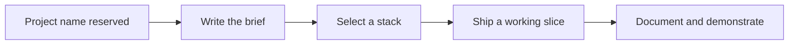

# Project Twilight

Project Twilight is currently a named concept repository. No product specification, implementation, assets, or executable configuration have been committed yet.

> This README records the repository's real status and leaves the product direction open until a brief is added.

## Current state

| Area | Status |
| --- | --- |
| Brief | Missing |
| Source code | Missing |
| Tests and CI | Not configured |
| Deployment | Not configured |

## Recommended next step

Document the intended audience, the problem being solved, the smallest useful workflow, and how success will be measured. Add setup and architecture sections here as soon as the first implementation lands.
Project Twilight Repo
